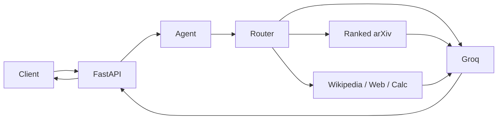

# Gray Matter LABS — Research Agent

**LangChain · Groq (Llama 3.3 70B) · FastAPI · Docker · Hugging Face Spaces**

Autonomous scientific Q&A API with **ranked arXiv search**, factual guardrails, and heuristic tool routing (DuckDuckGo, Wikipedia, calculator).

| | |
|---|---|
| **Live API (Space)** | Open this Space → `/docs` for Swagger |
| **GitHub** | [sidnei-almeida/langchain-autonomous-agent](https://github.com/sidnei-almeida/langchain-autonomous-agent) |
| **HF deploy guide** | [README_HF.md](./README_HF.md) |
| **Groq key** | [console.groq.com](https://console.groq.com) |

---

## Hugging Face Spaces (quick start)

1. **Create Space** → SDK: **Docker** → connect this repository (or push to the Space Git remote).
2. **Settings → Secrets** → add `GROQ_API_KEY` (required).
3. Wait for the Docker build; open **`/docs`** (port **7860** is set via `app_port` in this README front matter).
4. Test: `POST /api/query` with `{"question": "find papers about human-computer interaction"}`.

Full checklist: [README_HF.md](./README_HF.md).

---

## What it does

- **Gray Matter** persona — dry, precise lab tone; **not** a source of truth (no roleplay-as-fact).
- **arXiv pipeline** (`arxiv_search.py`) — ambiguity detection, query expansion, relevance scoring, no weak first-result dumps.
- **Groq** synthesis with low temperature (`0.2`) and conversation history limits.
- **REST API** — `/api/query`, `/api/chat`, `/health`, OpenAPI at `/docs`.



---

## Tools

| Tool | Role |
|------|------|
| **ArXiv** | Ranked papers (up to 12 candidates, score ≥ 6, clarification if vague) |
| **DuckDuckGo** | Recent web / news |
| **Wikipedia** | Encyclopedic background |
| **Calculator** | Sandboxed math |

---

## Local development

```bash
git clone https://github.com/sidnei-almeida/langchain-autonomous-agent.git
cd langchain-autonomous-agent
python -m venv venv && source venv/bin/activate
pip install -r requirements.txt
echo "GROQ_API_KEY=your_key_here" > .env
python app.py
```

- API: `http://localhost:7860`
- Docs: `http://localhost:7860/docs`

**Docker**

```bash
docker compose up --build
```

---

## Configuration

| Variable | Required | Description |
|----------|----------|-------------|
| `GROQ_API_KEY` | Yes | Groq API key (Space **Secrets** or `.env` locally) |
| `PORT` | No | HTTP port (default **7860**; HF sets this from `app_port`) |

---

## API endpoints

| Method | Path | Description |
|--------|------|-------------|
| GET | `/` | Metadata |
| GET | `/health` | Liveness |
| GET | `/api/tools` | Tool list |
| POST | `/api/query` | Single question |
| POST | `/api/chat` | Multi-turn chat |

Details: [API_DOCS.md](./API_DOCS.md).

---

## Repository layout

| Path | Role |
|------|------|
| `agent.py` | Agent, Groq, tools, system prompt |
| `arxiv_search.py` | arXiv ranking & clarification |
| `api.py` | FastAPI routes |
| `app.py` | Uvicorn entry (`PORT`) |
| `Dockerfile` | HF Spaces / Docker image |
| `requirements.txt` | Dependencies |
| `README_HF.md` | Spaces deployment |
| `API_DOCS.md` | REST reference |

---

## Space build files (required on HF)

The Docker image copies at minimum:

- `Dockerfile`
- `requirements.txt`
- `app.py`, `api.py`, `agent.py`, `arxiv_search.py`
- `README.md` (this file — YAML front matter configures the Space card)

---

## Limitations

- Heuristic routing (not native LLM tool-calling).
- Permissive CORS (`*`) — tighten for production.
- No built-in auth or rate limits.
- Outbound network to Groq, arXiv, Wikipedia, DuckDuckGo.

---

## Disclaimer

Persona inspired by a *Breaking Bad* archetype for **tone only** — independent project, not affiliated with rights holders. Users must comply with third-party terms (Groq, arXiv, etc.).

---

## License

MIT — see [LICENSE](./LICENSE).

**Maintainer:** [@sidnei-almeida](https://github.com/sidnei-almeida)
