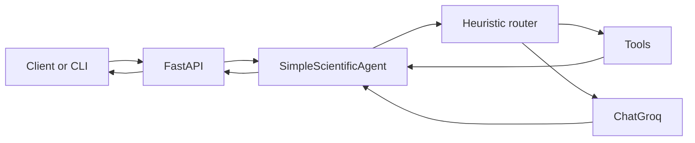

<!-- Optional: add a banner image at logos/long_logo.png and uncomment:
<p align="center">
  
</p>
-->

<p align="center">
  <strong>LangChain · Groq (Llama 3.3 70B) · FastAPI · Uvicorn · Docker</strong><br />
  <em>Autonomous scientific Q&A with heuristic tool routing, structured API responses, and optional CLI.</em>
</p>

<p align="center">
  <a href="https://github.com/sidnei-almeida/langchain-autonomous-agent"><strong>github.com/sidnei-almeida/langchain-autonomous-agent</strong></a>
</p>

<p align="center">
  Maintainer: <a href="https://github.com/sidnei-almeida">@sidnei-almeida</a>
</p>

<p align="center">
  <a href="./LICENSE"></a>
  <a href="https://www.python.org/"></a>
  <a href="https://fastapi.tiangolo.com/"></a>
  <a href="https://docs.docker.com/"></a>
  <a href="https://huggingface.co/spaces/salmeida/langchain-agent"></a>
</p>

<p align="center">
  <strong>The agent does not approximate. It calculates.</strong>
</p>

---

## Executive summary

**Heisenberg** (this repository) is a narrowly scoped **autonomous scientific assistant**: a FastAPI service and optional CLI that route user questions through **heuristic tool selection** (DuckDuckGo, Wikipedia, arXiv, a sandboxed calculator), inject retrieved context, and synthesize answers with **Groq’s Llama 3.3 70B** via LangChain. The design prioritizes **operational clarity**—the LLM does not call tools natively; the application layer decides when to search, summarize, or compute.

---

## Problem statement

General-purpose chat models answer from parametric memory alone; **scientific and citation-heavy work** benefits from **retrieval** (papers, encyclopedia, current web) and **deterministic math**. This stack wires those capabilities behind a single REST contract so clients (web UIs, scripts, Spaces) can consume **structured responses** (`tools_used`, `processing_time`, and optional URL/author extraction) without re-implementing orchestration.

---

## Quick links

- Repository: [sidnei-almeida/langchain-autonomous-agent](https://github.com/sidnei-almeida/langchain-autonomous-agent)
- License: [MIT](./LICENSE)
- API reference: [API_DOCS.md](./API_DOCS.md)
- Docker: [DOCKER.md](./DOCKER.md)
- Hugging Face Spaces: [README_HF.md](./README_HF.md)
- Security: [SECURITY_FIX.md](./SECURITY_FIX.md)
- Changelog: [CHANGELOG.md](./CHANGELOG.md)
- Live Space (example): [salmeida/langchain-agent](https://huggingface.co/spaces/salmeida/langchain-agent)
- Groq console: [console.groq.com](https://console.groq.com)

---

## Scope & guarantees

| Dimension | Detail |
|-----------|--------|
| **Runtime** | Python **3.11+** (see `Dockerfile` / `requirements.txt`) |
| **API** | **FastAPI** + **Uvicorn**; OpenAPI at `/docs` |
| **LLM** | **Groq** `llama-3.3-70b-versatile` (configurable in `agent.py`) |
| **Tool routing** | Keyword heuristics in `SimpleScientificAgent` — not native LLM tool-calling |
| **Network** | Outbound calls to Groq, DuckDuckGo, Wikipedia, arXiv as configured |
| **Secrets** | `GROQ_API_KEY` via `.env` (local) or platform secrets (Docker, HF Spaces) |

---

## Architecture (high level)



**Data flow:** the last user message is classified; zero or one tool runs; its output is appended as context; the LLM generates the final reply.

---

## Tools (functional surface)

| Tool | Role |
|------|------|
| **DuckDuckGo Search** | Recent web, news, general lookup |
| **Wikipedia** | Encyclopedic definitions and background |
| **ArXiv** | Paper metadata, abstracts, PDF links |
| **Scientific calculator** | `eval`-restricted math (`agent.py`) |

---

## Repository layout

| Path | Role |
|------|------|
| `agent.py` | Agent class, tools, system persona, CLI |
| `api.py` | FastAPI routes, models, structured extraction |
| `app.py` | Uvicorn entry (`PORT`, default `7860`) |
| `requirements.txt` | Python dependencies |
| `Dockerfile` / `docker-compose.yml` | Container image and local run |
| `LICENSE` | MIT full text |
| `API_DOCS.md` | REST specification |
| `DOCKER.md` | Build and cloud notes |
| `README_HF.md` | Hugging Face Spaces |
| `SECURITY_FIX.md` | Credential hygiene |
| `CHANGELOG.md` | Version history |

---

## Installation (development)

1. Clone the repository:
   ```bash
   git clone https://github.com/sidnei-almeida/langchain-autonomous-agent.git
   cd langchain-autonomous-agent
   ```
2. Create and activate a virtual environment:
   ```bash
   python -m venv venv
   source venv/bin/activate  # Windows: venv\Scripts\activate
   ```
3. Install dependencies:
   ```bash
   pip install -r requirements.txt
   ```
4. Create `.env` with your Groq key:
   ```bash
   echo "GROQ_API_KEY=your_key_here" > .env
   ```

---

## Usage

**REST API (default)**

```bash
python app.py
```

- Base URL: `http://localhost:7860`
- Interactive docs: `http://localhost:7860/docs`

**CLI**

```bash
python agent.py
python agent.py "What are the latest advances in quantum computing?"
```

**Docker**

```bash
docker compose up --build
```

See [DOCKER.md](./DOCKER.md) for production-oriented options.

---

## Configuration

| Variable | Required | Description |
|----------|----------|-------------|
| `GROQ_API_KEY` | Yes | Groq API key ([console.groq.com](https://console.groq.com)) |
| `PORT` | No | HTTP port (default `7860`, used by `app.py`) |

Model name, temperature, and `max_tokens` are set in `create_scientific_agent()` inside `agent.py`.

---

## API summary

| Method | Path | Description |
|--------|------|-------------|
| GET | `/` | Service metadata |
| GET | `/health` | Liveness and agent init |
| GET | `/api/tools` | Tool catalog |
| POST | `/api/query` | Single-turn question |
| POST | `/api/chat` | Multi-turn messages |

Full schemas: [API_DOCS.md](./API_DOCS.md).

---

## Known limitations

- **Heuristic routing** may misclassify intent; ambiguous queries may not trigger the intended tool.
- **Calculator** uses a restricted `eval`; treat as a utility, not a security boundary for untrusted multi-tenant input without additional hardening.
- **CORS** is permissive (`*`) in the reference `api.py` — tighten before public exposure.
- **No built-in authentication or rate limiting** — add at the edge (API gateway, reverse proxy).
- **Third-party TOS** — Groq, Wikipedia, arXiv, and search providers impose their own limits and policies.

---

## Privacy & security posture

- No first-party analytics or telemetry are embedded in this repository.
- API keys must not be committed; use `.gitignore` and platform secrets.
- Review `api.py` CORS and `agent.py` tool behavior for your deployment threat model.
- Authoritative guidance: [SECURITY_FIX.md](./SECURITY_FIX.md).

---

## Disclaimer & trademark note

The conversational persona is **inspired by a fictional character** from *Breaking Bad*. This is an **independent** educational and research project. It is **not affiliated with** AMC Networks, Sony Pictures Television, or the creators of *Breaking Bad*. *Breaking Bad* is a trademark of its respective owners.

Users are responsible for compliance with applicable law and with third-party terms (Groq, data providers, search APIs).

---

## Roadmap *(non-binding)*

- Optional native tool-calling / LangGraph path behind a feature flag.
- Stricter CORS and optional API-key middleware for production templates.

---

## License

This project is licensed under the **MIT License**.

- License file in this repository: [`LICENSE`](./LICENSE)
- SPDX identifier: `MIT`
- Standard text reference: [opensource.org/licenses/MIT](https://opensource.org/licenses/MIT)

---

## Maintainer

**Sidnei Alves de Almeida** — [@sidnei-almeida](https://github.com/sidnei-almeida)
