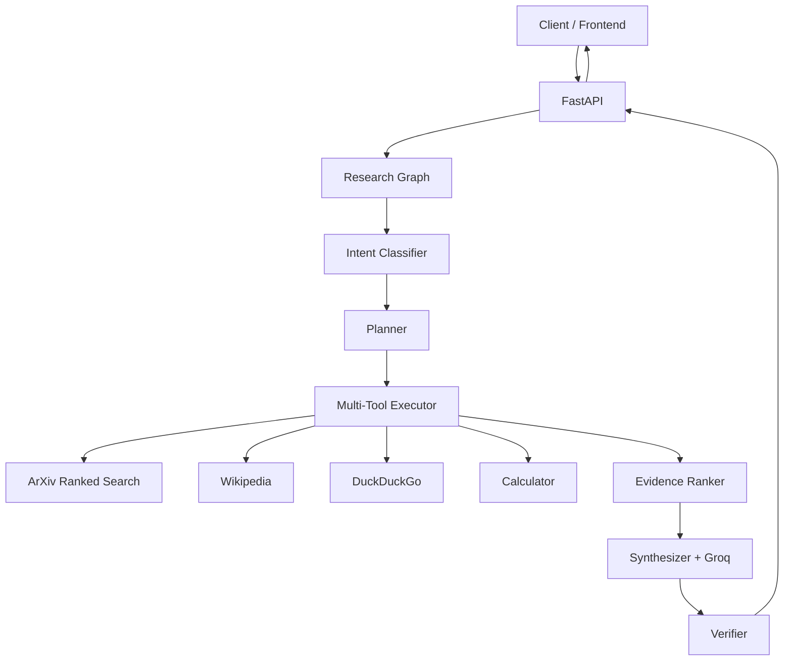

# Gray Matter Research Agent

**Agentic scientific research API** that plans, searches, ranks evidence, and synthesizes grounded answers using **Groq (Llama 3.3 70B)**, **LangChain**, **FastAPI**, **arXiv**, **Wikipedia**, **web search**, and a **deterministic calculator**.

Unlike a traditional RAG chatbot that retrieves once and answers, Gray Matter **classifies intent**, builds a **research plan**, runs **multiple tools** when needed, **ranks evidence**, **synthesizes** with citations, and **verifies** the answer before returning.

| | |
|---|---|
| **Live API (same HF Space)** | **https://salmeida-langchain-agent.hf.space** |
| **Swagger** | https://salmeida-langchain-agent.hf.space/docs |
| **GitHub** | [sidnei-almeida/langchain-autonomous-agent](https://github.com/sidnei-almeida/langchain-autonomous-agent) |
| **HF Space** | [salmeida/langchain-agent](https://huggingface.co/spaces/salmeida/langchain-agent) |
| **Groq** | Secret `GROQ_API_KEY` on the Space |

---

## Architecture



### Pipeline steps

1. **Classify** — LLM + heuristic fallback → intent, tools, depth, query rewrite
2. **Plan** — 2–5 operational steps (not chain-of-thought)
3. **Execute** — arXiv + web + Wikipedia + calculator as needed
4. **Rank** — normalize sources into a common evidence format
5. **Synthesize** — grounded answer with sources & limitations
6. **Verify** — flag invented URLs, unsupported paper claims, false recency

---

## vs Traditional RAG Chatbot

| | Traditional RAG | Gray Matter Research Agent |
|---|---|---|
| Routing | Single retrieval | Intent-based multi-tool |
| arXiv | First result | Ranked + relevance threshold |
| Ambiguity | Often hallucinates | Asks clarification |
| Evidence | Unstructured chunks | Scored source objects |
| Answer | Generate once | Synthesize + verify |
| API | Text only | Structured JSON (papers, plan, confidence) |

---

## Quick start (local)

```bash
git clone https://github.com/sidnei-almeida/langchain-autonomous-agent.git
cd langchain-autonomous-agent
python -m venv venv && source venv/bin/activate
pip install -r requirements.txt
echo "GROQ_API_KEY=your_key" > .env
python app.py
```

Open `http://localhost:7860/docs`

**CLI**

```bash
python -m agent "latest papers about agentic RAG"
```

---

## API examples

### POST `/api/query`

```bash
curl -X POST http://localhost:7860/api/query \
  -H "Content-Type: application/json" \
  -d '{"question": "Explain quantum entanglement"}'
```

### POST `/api/research` (deep mode)

```bash
curl -X POST http://localhost:7860/api/research \
  -H "Content-Type: application/json" \
  -d '{"question": "Compare RAG and agentic RAG", "depth": "deep", "max_sources": 12}'
```

### Example response (abridged)

```json
{
  "answer": "…synthesis with Sources used section…",
  "question": "latest papers about agentic RAG",
  "tools_used": ["search_scientific_papers", "web_search"],
  "intent": "mixed_research",
  "research_plan": [
    "Identify the scientific topic",
    "Search arXiv for recent papers",
    "Search web for current context",
    "Synthesize answer with sources"
  ],
  "papers": [
    {
      "title": "…",
      "year": 2024,
      "url": "https://arxiv.org/abs/…",
      "relevanceScore": 18,
      "whyItMatches": "…"
    }
  ],
  "sources": [
    {
      "title": "…",
      "url": "https://…",
      "source_type": "arxiv",
      "relevance_score": 0.85,
      "used_in_answer": true
    }
  ],
  "confidence": 0.78,
  "limitations": [],
  "follow_up_questions": ["Would you like a deeper summary of any specific paper?"],
  "processing_time": 8.4
}
```

### Clarification example

Query: `"paper about human interactions"`

```json
{
  "answer": "Human interactions is broad. Do you mean human-computer interaction…",
  "intent": "paper_search",
  "confidence": 0.3,
  "limitations": ["Query needs clarification before research can proceed."]
}
```

---

## Endpoints

| Method | Path | Description |
|--------|------|-------------|
| GET | `/health` | Liveness |
| GET | `/api/tools` | Tool catalog |
| POST | `/api/query` | Single-turn Q&A |
| POST | `/api/chat` | Multi-turn chat |
| POST | `/api/research` | Deep research mode |

---

## Configuration

| Variable | Required | Description |
|----------|----------|-------------|
| `GROQ_API_KEY` | Yes | Groq LLM key |
| `GRAY_MATTER_API_KEY` | No | Optional API key (`X-API-Key` header) |
| `CORS_ORIGINS` | No | Comma-separated origins (default `*`) |
| `PORT` | No | HTTP port (default `7860`) |
| `MAX_REQUEST_BYTES` | No | Request body limit (default `65536`) |

---

## Project structure

```
agent/
  state.py        # ResearchState, EvidenceItem, IntentResult
  router.py       # Intent classifier (LLM + fallback)
  planner.py      # Research plan builder
  tools.py        # Multi-tool executor
  evidence.py     # Source ranking
  synthesizer.py  # Answer generation
  verifier.py     # Claim verification
  graph.py        # Pipeline orchestration
arxiv_search.py   # Ranked arXiv with ambiguity detection
api.py            # FastAPI routes
```

---

## Screenshots

<!-- Portfolio placeholders -->
| Swagger UI | Research response |
|---|---|
| _Add screenshot: `/docs`_ | _Add screenshot: paper results JSON_ |

---

## Limitations

- Heuristic + LLM routing may misclassify edge cases
- Groq rate limits apply on HF Spaces
- No persistent memory across sessions
- Calculator uses sandboxed `eval` — not a security boundary for untrusted multi-tenant input
- Verifier is rule-based, not a full fact-checker

---

## Roadmap

- [ ] Native LangGraph tool-calling mode (feature flag)
- [ ] Streaming responses (`/api/research/stream`)
- [ ] Redis cache for arXiv queries
- [ ] Frontend: Gray Matter LABS chat UI
- [ ] Semantic reranker for evidence

---

## Hugging Face Spaces

1. SDK: **Docker** · Port: **7860**
2. Secret: `GROQ_API_KEY`
3. Optional: `GRAY_MATTER_API_KEY`, `CORS_ORIGINS`

See [README_HF.md](./README_HF.md).

---

## License

MIT — [LICENSE](./LICENSE) · Maintainer: [@sidnei-almeida](https://github.com/sidnei-almeida)
